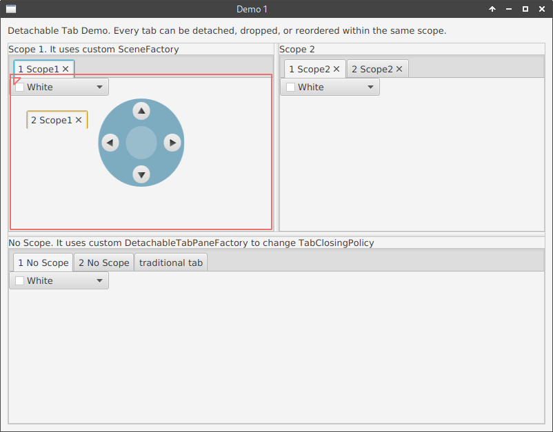

# Archived

This repository was created as an interim solution until the docking
component of TiwulFX was separated from TiwulFX 3.1. Please refer to
the following repository for more details:

[https://github.com/panemu/tiwulfx-dock](https://github.com/panemu/tiwulfx-dock)

---

# PitchDockFX

PitchDockFX is yet another JavaFX 11 docking framework. Dockable panels provide a way to rearrange major application components.

Code in this repository extracted and simplified from [TiwulFX 3.1](https://bitbucket.org/panemu/tiwulfx/src/master/).

# Demo

Run the demo as follows:

1. Open the project in IntelliJ.
1. Expand `com.keenwrite.dock.demo` under **src/test**.
1. Open `Launcher`.
1. Run `main`.

The application launches:

# Alternatives

This section reviews numerous JavaFX docking solutions. Except for TiwulFX, none of the other libraries could meet the requirements.

## Requirements

Hard (must) and soft (should) requirements include:

- Must work on Linux (X11, Wayland), Windows (7, 10), and OSX, minimally
- Must support drag-and-drop, tab reordering
- Must support JavaFX 11
- Must have demo Java code
- Must take < 10 minutes to run demo code (including upgrade to JavaFX 11)
- Must support Gradle 6.6.1 (or greater)
- Must have license
- Should have a small footprint (< 100 kb)
- Should be pane-based, but a tab-based solution is acceptable
- Should support styling (skins), including dark and light
- Should have hooks for persistence (coordinates, splitter positions)
- Should be well-documented
- Should have a burgeoning following (> 25 stargazers)

## Solutions

A number of solutions exist; this section reviews the pros and cons of each library. A ✔ indicates that it may be suitable for integration; a ✘ means the library is unsuitable (the reason for elimination is marked bold in the cons list); no mark means the library has not been put on trial.

### ✔ [PitchDockFX](https://github.com/DaveJarvis/PitchDockFX) (fork)

Forked from TiwulFX 3 (below) to extract docking functionality.

- **Pros:** Small footprint, can be styled, works on Linux, lightweight
- **Cons:** < 10 stargazers, tab-based, LGPLv2, forked

### ✘ [DraggableTabs](https://github.com/xylo/DraggableTabs)

- **Pros:** Small footprint, Apache License, can be styled, works on Linux, lightweight
- **Cons:** < 10 stargazers, minor bugs, tab-based, tab rearrangement is finicky at best, **no reorder support**

### ✘ [fx-docking-9](https://github.com/Valery-Sh/fx-docking-9)

- **Pros:** Potentially works with Linux and does not require tab-panes?
- **Cons:** No external documentation, < 10 stargazers, **no license**

### ✘ [TiwulFX 3](https://bitbucket.org/panemu/tiwulfx/)

- **Pros:** Recently updated, demo video looks good, supports JavaFX 11, works on Linux
- **Cons:** Framework, tab-based, LGPLv2.1, spreadsheet support, **no small footprint** (many dependencies, including POI)
- [Demo](https://www.youtube.com/watch?v=q_n23Ah1ftQ)

### ✘ <a href="https://github.com/RobertBColton/DockFX" class="rich-diff-level-one">DockFX</a>

- **Pros:** Looks great, exact functionality required, clean API, well-documented code, small size, 100+ stargazers
- **Cons:** LGPLv3, could be broken on Linux, unresolved issues dating to 2015, **no JavaFX 11 support**.
- [Screenshot](https://camo.githubusercontent.com/a29bf6ffe8051e3099c7270bd3e7e9313d3955da/687474703a2f2f73697465732e7073752e6564752f726f6265727462636f6c746f6e2f77702d636f6e74656e742f75706c6f6164732f73697465732f31393630382f323031342f31302f646f636b6678686f7665722e706e67)

### ✘ [DockFX](https://github.com/hkmoon/DockFX) (fork)

Fork of DockFX that includes numerous fixes.

- **Cons:** **No JavaFX 11 support**.

### ✘ <a href="https://github.com/kordamp/desktoppanefx" class="rich-diff-level-one">DesktopPaneFX</a>

- **Pros:** May not suffer from Linux-related issues, updated recently, looks good.
- **Cons:** Doesn't appear to be dockable, per se; < 100 stargazers; minimized windows take up screen real-estate; XFCE (X11?) hotkeys could have trouble being passed to the internal windows, **no JavaFX 11 support**.
- [Screenshot](https://github.com/kordamp/desktoppanefx/blob/master/screenshots/desktoppanefx.png)

### ✘ <a href="https://github.com/ccarlow/DndDockFX" class="rich-diff-level-one">DndDockFX</a>

- **Pros:** Small footprint, MIT license, true cross-platform, excellent summary of issues with other docking APIs
- **Cons:** < 50 stargazers, tab-based, **no Linux support**

### ✘ [DockSystemFX](https://github.com/Dansoftowner/DockSystemFX)

- **Pros:** Well-documented, Apache 2 License, looks great, skinnable, panels can be hidden various ways
- **Cons:** < 10 stargazers, **fixed-layout**, **no drag-and-drop support**

### ✘ [MiniDockFx](https://github.com/skfcz/MiniDockFx)

- **Pros:** Small footprint, BSD license, true cross-platform, identifies issues with other dockers, updated recently, stores split positions as preferences
- **Cons:** < 10 stargazers, tab-based, **fixed-layout**
- [Screenshot](https://raw.githubusercontent.com/skfcz/MiniDockFx/master/data/screen.png)

### ✘ [AnchorFX](https://github.com/alexbodogit/AnchorFX)

- **Pros:** Looks good, pane-based, simple API, 100+ stargazers
- **Cons:** LGPLv3, no recent activity, **no Linux support**
- [Screenshot](https://raw.githubusercontent.com/alexbodogit/AnchorFX/master/src/main/resources/screenshot.png)

### ✘ [FxDock](https://github.com/andy-goryachev/FxDock)

- **Pros:** Simple framework, Apache License, recent activity
- **Cons:** < 50 stargazers, tab-based, **no Linux support**
- [Screenshot](https://raw.githubusercontent.com/andy-goryachev/FxDock/master/screenshots/2016-0521-125006-709.png)

### ✘ [Drombler FX](https://github.com/Drombler/drombler-fx)

- **Pros:** Well-documented, well-organized, OSGi-compliant
- **Cons:** < 100 stargazers, Tab-based, duplicate functionality with existing code base, more of an application framework than docking widget, **no drag-and-drop support** ([JDK bug](https://bugs.openjdk.java.net/browse/JDK-8092098))
- [Example](https://www.drombler.org/drombler-fx/1.0/docs/tutorial/images/docking/docking-areas-tutorial.png)

### ✘ [FxDocking](https://github.com/kasemir/FxDocking)

- **Pros:** Very small footprint
- **Cons:** Tab-based, < 10 stargazers, incomplete, **no Linux support**
- [Screenshot](https://raw.githubusercontent.com/alexbodogit/AnchorFX/master/src/main/resources/screenshot.png)

### ✘ [javafx.DndTabPane](https://github.com/sibvisions/javafx.DndTabPane)

- **Pros:** Small footprint, skinnable, EPL license, true cross-platform
- **Cons:** < 10 stargazers, tab-based, **no Java demo code**

### [iroshell](https://github.com/JeffreyRiggle/iroshell)

I did not run (or create) a demo for this framework.

- **Pros:** Provides multi-document interface (presumably dockable), MIT license, updated recently
- **Cons:** < 10 stargazers, UI framework (not a simple widget)

